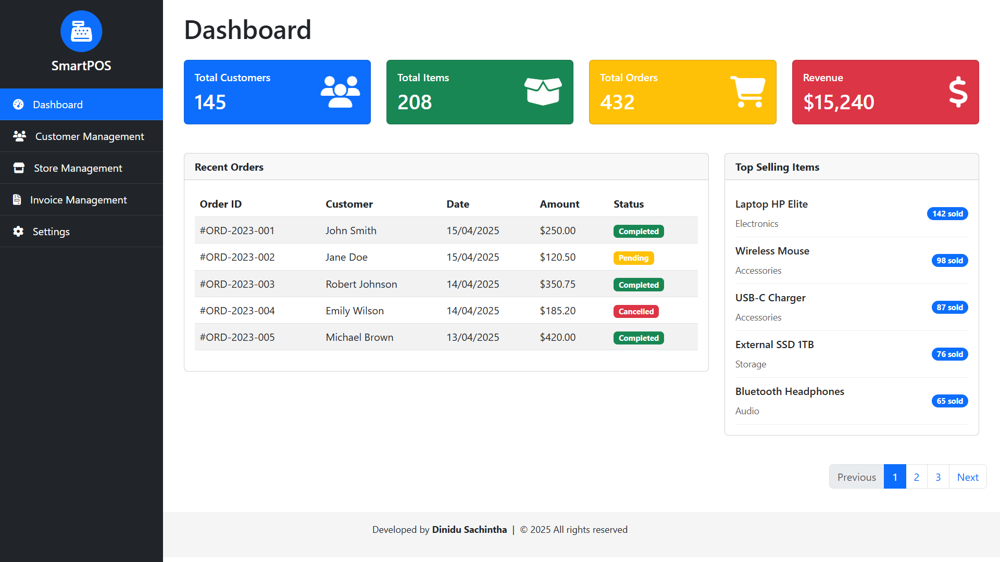
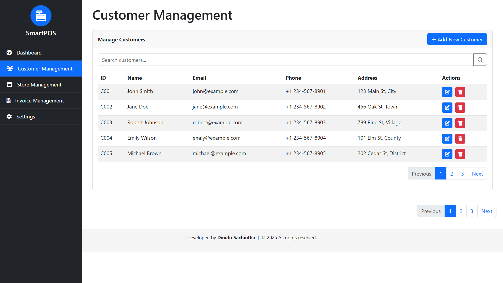
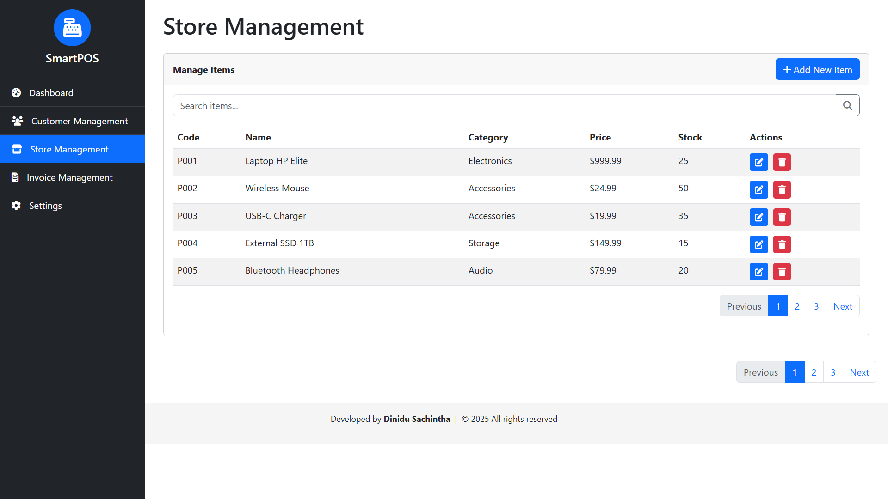
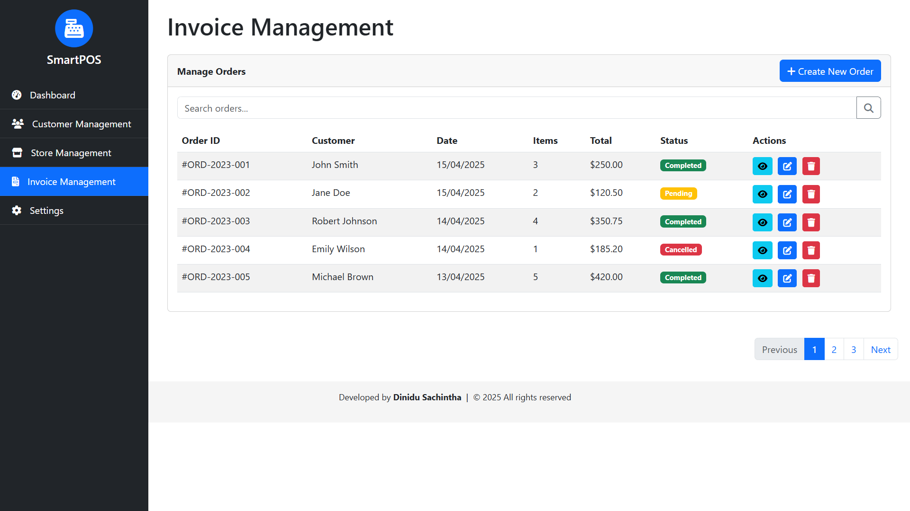
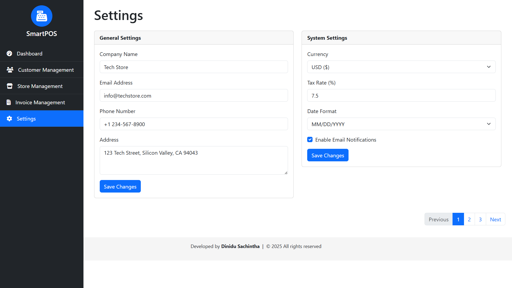

# Point of Sale (POS) System [](https://app.netlify.com/sites/smart-pos-dinidu/deploys)
```Smart your own Point of Sale (POS) system is designed to help you manage sales, customers, and invoices efficiently.```

## Tech Stack
[](https://skillicons.dev)

## Dashboard
The dashboard provides a comprehensive overview of the POS system's performance.




## Customer Management
The customer management section allows you to view and manage customer information.



## Store Management
The store management section allows you to view and manage store information.



## Invoice Management
The invoice management section allows you to view and manage invoices.



## Settings
The settings section allows you to configure various aspects of the POS system.


